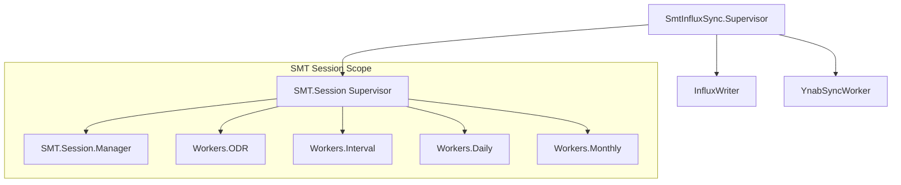

# Architecture: `smt_influx_sync`

This document describes the high-level architecture and design decisions of the `smt_influx_sync` project.

## System Overview

The system is a resilient synchronization bridge between the **Smart Meter Texas (SMT)** API and **InfluxDB v2**. It also optionally integrates with **YNAB** to update budget targets based on historical electricity usage.

The application is built using Elixir/OTP, leveraging its supervision trees for fault tolerance and its concurrency model for independent, non-blocking synchronization tasks.

---

## Supervision Tree

The application follows a hierarchical supervision structure to ensure that failures are isolated and the system can recover automatically.

### 1. Root Supervisor (`SmtInfluxSync.Application`)
Uses a `:one_for_one` strategy. If the `InfluxWriter` or the `SMT.Session` supervisor crashes, they are restarted independently.

### 2. InfluxDB Writer (`SmtInfluxSync.InfluxWriter`)
A dedicated GenServer responsible for all writes to InfluxDB.
- **Resilience**: It uses **DETS** (Disk Erlang Term Storage) to queue writes if InfluxDB is unreachable or returns an error.
- **Efficiency**: It flushes queued writes in batches of up to 5,000 points using the InfluxDB Line Protocol.

### 3. SMT Session Supervisor (`SmtInfluxSync.SMT.Session`)
Uses a **`:rest_for_one`** strategy. This is a critical design choice:
- The **`Session.Manager`** is the first child. It handles authentication and meter resolution.
- All **Sync Workers** follow.
- **If the Manager restarts** (e.g., due to a credential change or session crash), all workers are also restarted. This ensures workers never operate with stale or invalid session state.

---

## Component Responsibilities

### Session Management (`SmtInfluxSync.SMT.Session.Manager`)
- **Authentication**: Exchanges SMT credentials for a Bearer token.
- **Persistence**: Saves the token to disk (`Config.token_path()`) to avoid redundant logins across restarts.
- **Resolution**: Discovers the ESIID and Meter Number if not explicitly configured.
- **Refresh**: Provides a `refresh_token/0` API that workers can call when they receive a `401 Unauthorized` response.

### Sync Workers (`SmtInfluxSync.Workers.*`)
Each worker is an independent GenServer with its own configurable interval:
- **ODR (On-Demand Read)**: Requests a real-time meter read. It is rate-limited by SMT (2/hour, 24/day) and includes logic to reuse "recent" reads.
- **Historical (Interval, Daily, Monthly)**: Fetches historical usage data. They track their progress by saving the last successful sync date to disk (`last_sync_<source>`), ensuring they only fetch new data on subsequent runs.

### YNAB Integration (`SmtInfluxSync.YnabSyncWorker`)
A separate worker that queries InfluxDB for the last 12 months of usage, calculates a monthly average, and updates a YNAB category's budget target. This provides a "rolling budget" based on actual electricity costs.

---

## Data Flow

1.  **Startup**: `Session.Manager` loads or fetches an SMT token and resolves meter info.
2.  **Trigger**: A `Worker` wakes up based on its `sync_interval_ms`.
3.  **Fetch**: Worker calls `Session.Manager.get_credentials()` and then makes an API request via `SMTClient`.
4.  **Process**: Data is parsed and formatted into InfluxDB Line Protocol via `Workers.Helper`.
5.  **Write**: Worker sends data to `InfluxWriter.write_batch/1`.
6.  **Persistence**: `InfluxWriter` immediately attempts an HTTP POST to InfluxDB. If it fails, the data is saved to a `.dets` file for later retry.

---

## Design Principles

- **Fault Isolation**: An error in the Monthly sync (e.g., a parsing bug in a specific API response) does not prevent the ODR sync from running.
- **Graceful Degradation**: If SMT is down, the `Session.Manager` enters a retry loop. If InfluxDB is down, the `InfluxWriter` queues data to disk. The system is designed to "catch up" once services recover.
- **Configuration over Hardcoding**: Intervals, paths, and limits are all tunable via environment variables to support different deployment environments (Docker, bare metal, etc.).
